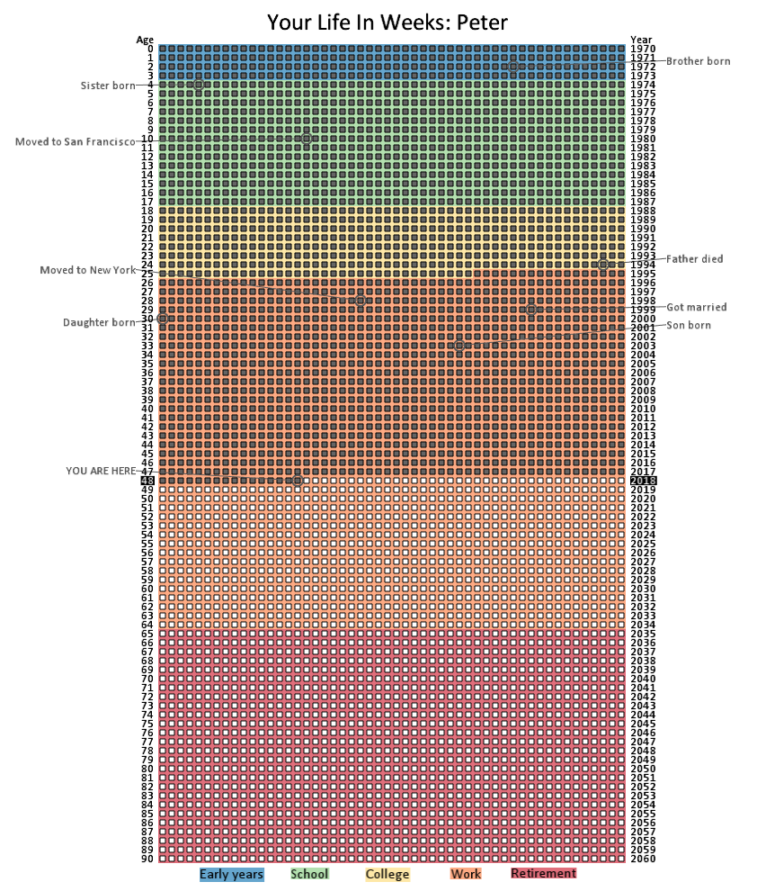

# Your Life in Weeks
Display a calendar of your life in weeks. Each row represents a year in your life, each square is a week.

Inspired by Tim Urban's excellent post: [http://waitbutwhy.com/2014/05/life-weeks.html](http://waitbutwhy.com/2014/05/life-weeks.html)

Written in [IDL](http://www.harrisgeospatial.com/docs/using_idl_home.html)

